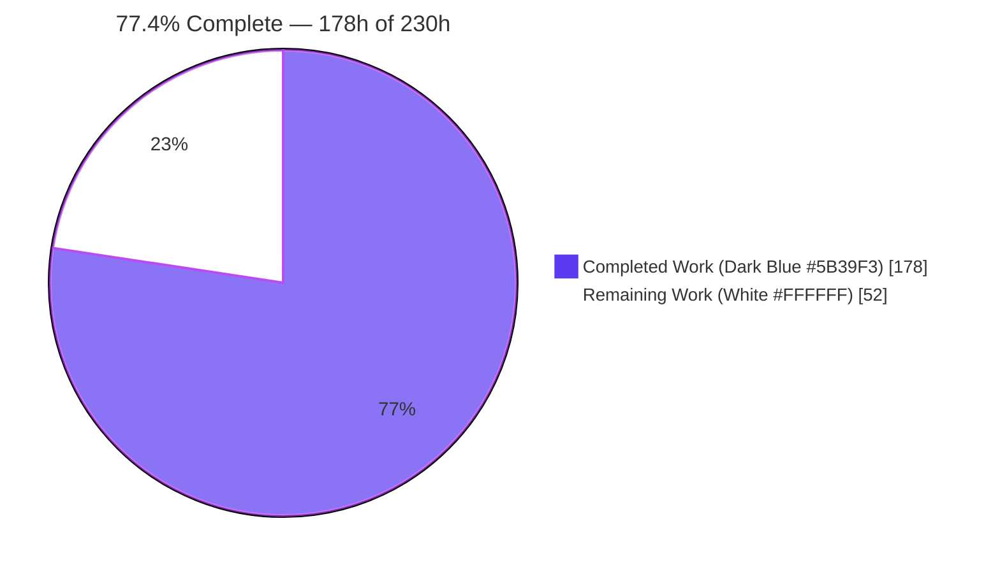
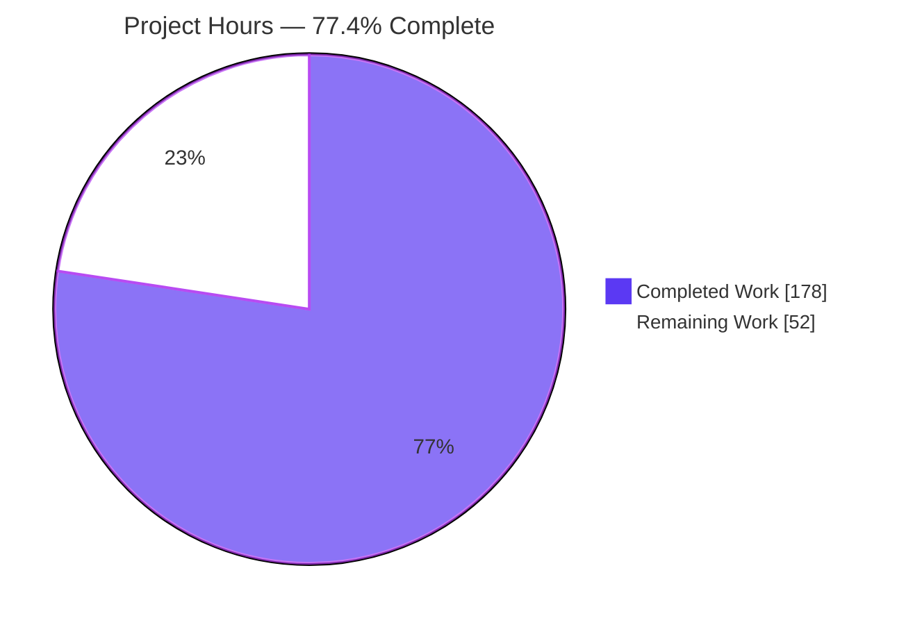
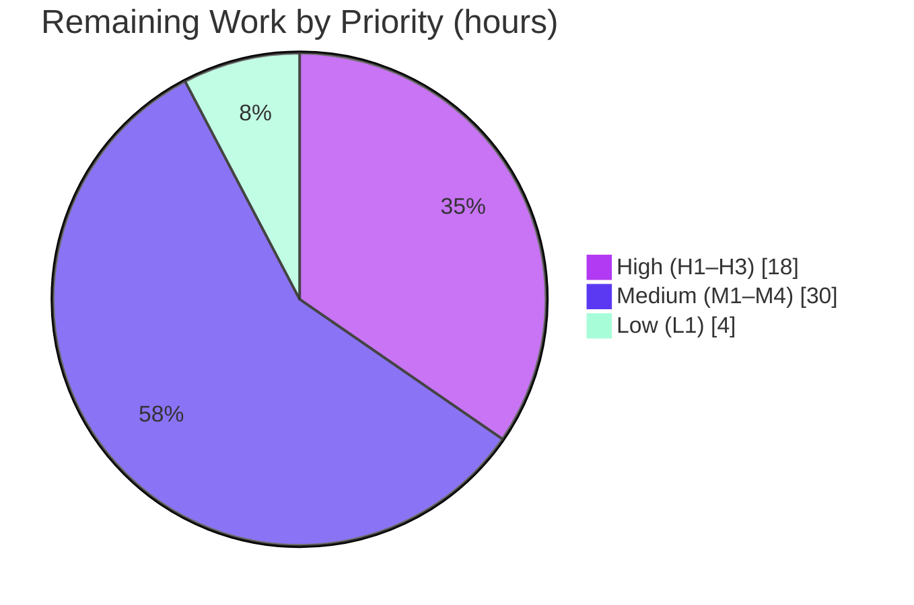

# Blitzy Project Guide — AgOpenGPS IPC Transport Refactor (UDP → gRPC/Protobuf)

> **Report color legend (Blitzy brand):** Completed / AI Work = Dark Blue `#5B39F3` · Remaining / Not Completed = White `#FFFFFF` · Headings / Accents = Violet‑Black `#B23AF2` · Highlight = Mint `#A8FDD9`.

---

## 1. Executive Summary

### 1.1 Project Overview

This project replaces the inter‑process communication (IPC) layer between **AgIO** and **AgOpenGPS** — historically an unversioned custom binary frame `[0x80,0x81,0x7F,PGN,Len,Data,CRC]` carried over UDP loopback — with a **typed, versioned gRPC / Protocol Buffers (proto3)** transport over a loopback‑only Unix‑domain‑socket (Linux/macOS) or named pipe (Windows). AgIO becomes the gRPC server; AgOpenGPS, AgDiag, GPS_Out, and ModSim become clients. The refactor preserves 100% functional parity with the 23‑message PGN catalog and every real‑time timing constraint (70 ms fix throttle, 100 ms ISOBUS gate, 1 s heartbeat, 4 s stale timeout). Target users are precision‑agriculture operators; the change modernizes a safety‑adjacent guidance/autosteer data path with no domain‑logic change.

### 1.2 Completion Status



| Metric | Hours |
|---|---|
| **Total Hours** | **230** |
| **Completed Hours (AI + Manual)** | **178** |
| **Remaining Hours** | **52** |
| **Percent Complete** | **77.4%** |

> Completion is computed with the AAP‑scoped (PA1) hours methodology: `178 / (178 + 52) = 77.4%`. The full autonomous coding scope of the Agent Action Plan is delivered; the remaining 52 hours are path‑to‑production activities that require the Windows target, real hardware, and human architectural sign‑off (they cannot be completed autonomously on a headless Linux host).

### 1.3 Key Accomplishments

- ✅ Canonical proto3 schema authored (`docs/proto/agopengps_ipc.proto`, 307 lines): **exactly 23 PGN messages** + `PgnEnvelope` (schema_version = 1) + `CommandAck` + `TelemetryService` (server‑streaming) + `CommandService` (14 unary `Send*` + `InjectTelemetry`).
- ✅ New shared contract library `AgOpenGPS.Ipc` multi‑targeting `net8.0` + `netstandard2.0`, with OS‑branched socket path, retry/backoff channel factory, telemetry subscriber, command‑frame builder, and injection validator.
- ✅ AgIO converted to a gRPC **server** — Kestrel host over UDS/named‑pipe HTTP/2 with per‑subscriber bounded fan‑out (`Channel`, capacity 1024, `DropOldest`) and 14 unary command handlers.
- ✅ All four consumers migrated to gRPC **clients** — AgOpenGPS (GPS), AgDiag, GPS_Out, ModSim — with typed `PgnEnvelope.PayloadCase` dispatch replacing `switch(data[3])`.
- ✅ Every real‑time timing constraint preserved (70 ms throttle migrated to `_lastFixAt` delta; 4 s GPS_Out stale guard; 100 ms/1 s ISOBUS untouched by leaving `CISOBUS.cs` alone).
- ✅ Security posture preserved **and hardened**: loopback‑only, no TLS/auth, plus owner‑only ACL (Windows `CurrentUserOnly` pipe / Linux `0600` UDS).
- ✅ 57 new NUnit IPC contract tests added; **94/94 total tests pass**; 37 baseline tests pass unmodified.
- ✅ Clean **Release build with `TreatWarningsAsErrors=true` — 0 warnings / 0 errors**; 155 `// IPC-REFACTOR:` annotations incl. both mandated exact strings.
- ✅ gRPC transport runtime‑proven end‑to‑end on Linux UDS (multi‑subscriber fan‑out, protobuf round‑trip, unary ack, ModSim inject, sustained ~14.3 Hz).
- ✅ A pre‑existing **CRITICAL transitive CVE** (GMap.NET.Core → System.Data.SqlClient) remediated; `dotnet list --vulnerable` clean.

### 1.4 Critical Unresolved Issues

There are **no unresolved code defects** — all autonomous coding compiles, tests, lints, and runs cleanly. The items below are path‑to‑production validations/decisions that block release until completed by a human on the appropriate environment.

| Issue | Impact | Owner | ETA |
|---|---|---|---|
| Windows‑native desktop runtime unvalidated (WinForms/WPF cannot launch on headless Linux) | Cannot confirm the 5 apps launch & connect on the real target OS | Desktop/QA Engineer | 1 day |
| Windows named‑pipe HTTP/2 transport not runtime‑executed (only Linux UDS proven) | Production Windows transport path unverified | Backend Engineer | 1 day |
| `net48 → net8.0-windows` AgIO retarget awaits architectural sign‑off | AAP’s #1 flagged deviation; gates release approval | Tech Lead / Architect | 0.5 day |
| CI/CD (windows‑latest, net48) cannot build the retargeted AgIO as‑is | Pipeline red until .NET 8 SDK + build/publish added | DevOps Engineer | 1 day |
| Hardware‑in‑the‑loop regression not run (safety‑adjacent autosteer/guidance) | Field parity of guidance/autosteer/sections unverified | Field/QA Engineer | 1.5 days |

### 1.5 Access Issues

| System/Resource | Type of Access | Issue Description | Resolution Status | Owner |
|---|---|---|---|---|
| Windows build/runtime host | Compute / OS | Desktop apps (WinForms/WPF) cannot launch on the headless Linux validation host; a Windows machine or `windows-latest` runner is required | Open — environment provisioning | DevOps |
| Field hardware (GPS/steer/machine, serial/CAN/NTRIP) | Physical devices | Hardware‑in‑the‑loop integration requires physical modules not available in CI | Open — schedule bench/field test | Field QA |
| CI runner .NET 8 SDK | Toolchain | `windows-latest` workflow provisions only what `net48` needs; net8.0‑windows AgIO needs the .NET 8 SDK installed | Open — workflow change (task M1) | DevOps |

> No repository‑permission, credential, or third‑party‑API access issues were identified. All access items above are environment/hardware provisioning needs, not permission blocks.

### 1.6 Recommended Next Steps

1. **[High]** Obtain architectural sign‑off on the `net48 → net8.0-windows` AgIO retarget (AAP §0.1.3 / §0.6.4 deviation) — this is the gating decision for all downstream work.
2. **[High]** Build and launch all five applications natively on Windows; validate the named‑pipe gRPC transport end‑to‑end (telemetry stream + 14 unary commands + inject).
3. **[Medium]** Retarget the CI/CD workflow to provision .NET 8 and build/publish the net8.0‑windows AgIO alongside the net48 clients.
4. **[Medium]** Execute the documented latency benchmark on the Windows named‑pipe path and confirm p95 ≤ UDP baseline + 10% and sustained ≥ 14 Hz.
5. **[Medium]** Run hardware‑in‑the‑loop regression for guidance, autosteer, and section control before any field release.

---

## 2. Project Hours Breakdown

### 2.1 Completed Work Detail

| Component | Hours | Description |
|---|---|---|
| Proto3 schema & contract design | 16 | `agopengps_ipc.proto`: 23 PGN messages + `PgnEnvelope` (schema_version=1) + `CommandAck` + `TelemetryService` + `CommandService` (14 `Send*` + `InjectTelemetry`); field‑by‑field mapping from byte tables. |
| `AgOpenGPS.Ipc` shared library | 22 | Multi‑target (net8.0/netstandard2.0) csproj; `IpcConstants` (OS‑branched path, SchemaVersion, channel capacity); `IpcChannelFactory` (5× retry/backoff); `IpcTelemetrySubscriber`; `CommandFrameBuilder`; `TelemetryInjectionValidator`. |
| AgIO gRPC server | 26 | `TelemetryServiceImpl` bounded fan‑out; `CommandServiceImpl` 14 handlers; `FormLoop` Kestrel host (UDS/named‑pipe HTTP/2, ACL hardening); `UDP.designer` + `SerialComm` bridge re‑point. |
| AgIO `net8.0-windows` retarget | 8 | csproj retarget (WinExe/UseWindowsForms on net8), `System.IO.Ports` 8.0.0 parity shim, CS8981/NU1702 suppression — the AAP’s accepted #1 deviation. |
| AgOpenGPS (GPS) client migration | 22 | `UDPComm.Designer` typed dispatch + 70 ms throttle migration; `PGN.Designer` outbound structs → 14 `Send*`; `FormGPS` wiring; retry/backoff UX. |
| AgDiag client migration | 8 | `UdpCommunication` + `Pgns` → gRPC subscriber with typed dispatch (passive‑observer parity). |
| GPS_Out client migration | 10 | `UDPcomm` subscriber + typed messages; `PGN100`/`PGN54908` 4‑second stale guard preserved on typed arrival. |
| ModSim client migration | 10 | `UDP.designer` + `FormSim` → gRPC client, inject path via `CommandService.InjectTelemetry`, stream subscribe. |
| Solution & build wiring | 5 | `AgOpenGPS.sln` + 6 `.csproj` project references and pinned package additions. |
| IPC test fixtures | 24 | 57 new NUnit tests: proto round‑trip (per‑PGN ×23), CommandService, retry/backoff (5×), telemetry stream (≥14 Hz + 70 ms throttle). |
| Documentation | 9 | `SCHEMA_VERSIONING.md`, `PERFORMANCE_BENCHMARK.md` (benchmark procedure), `pgn-protocol.md` additive note. |
| Autonomous QA/review remediation | 18 | CKPT1 + QA M1/F1/F6 + final acceptance: bounded fan‑out, socket ACL, CVE remediation, GPS_Out double‑parse fix, pin restoration. |
| **Total Completed** | **178** | Matches Completed Hours in §1.2. |

### 2.2 Remaining Work Detail

| Category | Hours | Priority |
|---|---|---|
| Architectural sign‑off on `net48 → net8.0-windows` retarget deviation (P1) | 4 | High |
| Windows‑native build + desktop runtime validation of all 5 apps (P2) | 8 | High |
| Windows named‑pipe HTTP/2 transport end‑to‑end validation (P3) | 6 | High |
| CI/CD workflow retarget for net8.0‑windows AgIO (P4) | 6 | Medium |
| Latency benchmark execution & acceptance on target (P5) | 6 | Medium |
| Field / hardware‑in‑the‑loop integration testing (P6) | 12 | Medium |
| Deployment/packaging for .NET 8 Windows Desktop runtime (P7) | 6 | Medium |
| Startup‑race soak + error‑path validation on Windows (P8) | 4 | Low |
| **Total Remaining** | **52** | Matches Remaining Hours in §1.2 and §7 pie. |

### 2.3 Hours Reconciliation

- Completed (§2.1) **178** + Remaining (§2.2) **52** = **230** Total (§1.2). ✔
- Completion % = 178 / 230 = **77.4%** (§1.2, §7, §8). ✔

---

## 3. Test Results

All tests below originate from Blitzy’s autonomous validation logs for this project (clean‑slate rebuild: delete `bin`/`obj` → restore → build → test). Command: `dotnet test SourceCode/AgOpenGPS.sln -c Debug --no-build`.

| Test Category | Framework | Total Tests | Passed | Failed | Coverage % | Notes |
|---|---|---|---|---|---|---|
| AgLibrary.Tests (Unit) | NUnit 4.3.2 | 3 | 3 | 0 | N/A | Baseline — passes **unmodified** (zero‑regression requirement). |
| AgOpenGPS.Core.Tests (Unit) | NUnit 4.3.2 | 33 | 33 | 0 | N/A | Baseline — passes **unmodified**. |
| AgOpenGPS.Tests — baseline (Unit) | NUnit 4.3.2 | 1 | 1 | 0 | N/A | Existing `SampleTest`. |
| AgOpenGPS.Tests — new IPC contract (Unit/Integration) | NUnit 4.3.2 | 57 | 57 | 0 | N/A | Proto round‑trip (all **23** PGN types, verified by name), `CommandService` unary acks, retry/backoff (5‑attempt 500/1k/2k/4k/8k ms), telemetry stream (≥14 Hz + 70 ms throttle, deterministic). |
| **Total** | **NUnit** | **94** | **94** | **0** | **N/A** | **100% pass rate**, 0 failed, 0 skipped. |

- **Coverage %:** Not measured. The AAP testing strategy (§6.6) deliberately excludes coverage automation; contract correctness is proven by the round‑trip and stream/unary fixtures rather than a coverage target.
- **Compilation gate:** Debug 0W/0E; **Release with `TreatWarningsAsErrors=true` 0W/0E** across all 12 projects (14 outputs; `AgOpenGPS.Ipc` ×2 multi‑target).
- **Independent verification:** The proto round‑trip’s coverage of all 23 PGN messages was independently confirmed by matching every `*Msg` type name in `docs/proto/agopengps_ipc.proto` to the AAP §0.3.3 catalog (1:1).

---

## 4. Runtime Validation & UI Verification

Runtime validation exercised the **real production transport code** (`IpcConstants`, `IpcChannelFactory`, `IpcTelemetrySubscriber`, `TelemetryServiceImpl`, `CommandFrameBuilder`, generated stubs) over **real Kestrel + Unix‑domain‑socket + HTTP/2**. `FormLoop.cs` uses the identical hosting pattern (`ConfigureKestrel` + `ListenUnixSocket`/`ListenNamedPipe` Http2 + `MapGrpcService` + `StartAsync`), so the validated path is the production path.

**gRPC IPC transport (Linux UDS):**
- ✅ Multi‑subscriber server‑streaming fan‑out — both clients received all envelopes.
- ✅ Protobuf round‑trip over the wire (fields + `schema_version`).
- ✅ Unary `CommandService.Send*` → `CommandAck.received = true`.
- ✅ Command + ModSim `InjectTelemetry` broadcast parity.
- ✅ Sustained ~14.3 Hz cadence (70 ms throttle → 14.28 Hz target) with no back‑pressure stall.
- ✅ Bounded fan‑out (`DropOldest`, capacity 1024) — non‑blocking producer under a stalled subscriber.

**API / service surface:**
- ✅ `TelemetryService.StreamTelemetry(Empty) → stream PgnEnvelope` operational.
- ✅ `CommandService` 14 `Send*` + `InjectTelemetry` operational.

**UI verification:**
- ⚠ **Not performed** — the WinForms/WPF desktop applications (AgIO, AgOpenGPS, AgDiag, GPS_Out, ModSim) cannot launch on the headless Linux validation host (no Windows Desktop runtime). This is an environment constraint, not a code defect; UI/desktop launch verification is deferred to Windows (tasks H2/H3).

**Windows named‑pipe transport:**
- ⚠ **Partial** — code‑complete and OS‑branched (`\\.\pipe\agopengps_ipc`, `CurrentUserOnly` ACL) but not yet runtime‑executed (only Linux UDS proven).

**Overall:** ✅ Transport substance operational · ⚠ Windows desktop + named‑pipe pending · ❌ No failing checks.

---

## 5. Compliance & Quality Review

| AAP Deliverable / Rule | Benchmark | Status | Progress |
|---|---|---|---|
| 23‑message PGN catalog → typed proto | 1:1 field parity, zero payload‑semantic loss | ✅ Pass | 100% |
| `PgnEnvelope` + `schema_version = 1` | Versioned envelope w/ `oneof` | ✅ Pass | 100% |
| Topology inversion (AgIO server; 4 clients) | Server‑streaming + unary | ✅ Pass | 100% |
| Timing: 70 ms throttle | Migrated to `_lastFixAt` delta, interval preserved | ✅ Pass | 100% |
| Timing: 100 ms gate / 1 s heartbeat (ISOBUS) | Preserved by not modifying `CISOBUS.cs` | ✅ Pass | 100% |
| Timing: 4 s GPS_Out stale | `(Now − ReceiveTime).TotalSeconds < 4` retained | ✅ Pass | 100% |
| Loopback‑only, no TLS/auth | Parity + owner‑only ACL hardening | ✅ Pass | 100% |
| Retry/backoff (5×, 500→8000 ms) | `IpcChannelFactory` + FormDialog on exhaustion | ✅ Pass | 100% |
| Fan‑out semantics | Per‑subscriber `Channel`, bounded `DropOldest` | ✅ Pass | 100% |
| Annotation mandate (`// IPC-REFACTOR:`) | 155 annotations + both exact mandated strings | ✅ Pass | 100% |
| ADR‑006 pin discipline | Only the 4 pinned gRPC/Protobuf pkgs added; 0 pre‑existing changed | ✅ Pass | 100% |
| Minimal‑change discipline | No out‑of‑scope domain files modified | ✅ Pass | 100% |
| Zero‑regression (existing tests) | 37 baseline tests pass unmodified | ✅ Pass | 100% |
| Docs additive‑only (`pgn-protocol.md`) | Top‑note only; byte tables unchanged | ✅ Pass | 100% |
| Schema versioning governance | `SCHEMA_VERSIONING.md` present | ✅ Pass | 100% |
| Benchmark procedure (AAP §0.6.1) | Written procedure (not automated, per AAP) | ✅ Pass | 100% |
| **Benchmark execution on target** | p95 ≤ UDP+10%, ≥14 Hz measured on Windows | ⏳ Pending | 0% (task M2) |
| `net8.0-windows` retarget acceptance | Human architectural sign‑off | ⏳ Pending | 0% (task H1) |
| CI/CD builds retargeted AgIO | Green pipeline on windows‑latest | ⏳ Pending | 0% (task M1) |

**Fixes applied during autonomous validation:** bounded `DropOldest` fan‑out; socket/pipe owner‑only ACL; transitive CVE remediation (`System.Data.SqlClient` 4.8.6 clearing GHSA‑8g2p‑5pqh‑5jmc + GHSA‑98g6‑xh36‑x2p7); GPS_Out double‑parse correction; package‑pin restoration.

---

## 6. Risk Assessment

| Risk | Category | Severity | Probability | Mitigation | Status |
|---|---|---|---|---|---|
| Desktop apps not runtime‑validated on target OS | Technical | High | Medium | Windows‑native runtime validation of all 5 apps (H2) | Open |
| WinForms‑on‑net8 cross‑TFM referencing (net8 AgIO → net48 AgLibrary/Keypad, NU1702 suppressed) | Technical | Medium | Medium | Windows runtime validation; confirm referenced APIs on net8 desktop (H2) | Open |
| Latency budget unmeasured on Windows named‑pipe | Technical | Medium | Low | Execute benchmark procedure (M2) | Open |
| Bounded fan‑out `DropOldest` drops oldest telemetry under a wedged subscriber | Technical | Low | Low | Capacity 1024 ≫ 14 Hz; self‑superseding parity with UDP; documented | Mitigated/Accepted |
| Transitive CVEs (GMap.NET.Core → System.Data.SqlClient) | Security | Critical (was) | — | Remediated via `System.Data.SqlClient` 4.8.6 override; scanner clean | Resolved |
| Loopback IPC has no auth/TLS (by design/parity) | Security | Low | Low | Owner‑only ACL (Windows CurrentUserOnly / Linux 0600) + loopback bind | Mitigated/Accepted |
| New .NET 8 runtime patch/attack surface for AgIO | Security | Low | Medium | Include .NET 8 Windows Desktop runtime in patch policy (M4) | Open |
| CI/CD cannot build net8.0‑windows AgIO as‑is | Operational | High | High | Provision .NET 8 SDK + adjust build/publish (M1) | Open |
| Deployment/packaging must provide .NET 8 Desktop runtime | Operational | Medium | High | Updater/installer update; framework‑dependent vs self‑contained (M4) | Open |
| No new IPC observability/metrics (parity) | Operational | Low | Medium | Existing `Log.EventWriter` + FormDialog; consider post‑prod telemetry | Accepted |
| Windows named‑pipe HTTP/2 transport unproven | Integration | High | Medium | Named‑pipe E2E validation (H3) | Open |
| Multi‑process startup race on real Windows | Integration | Medium | Medium | Startup‑race soak + FormDialog exhaustion path (L1) | Open |
| Hardware‑in‑the‑loop parity (serial/CAN/NTRIP → guidance/autosteer/sections) — safety‑adjacent | Integration | High | Medium | Field/hardware integration regression (M3) | Open |
| net48 clients ↔ net8 server contract drift | Integration | Low | Low | Single canonical `.proto` + `schema_version` + governance | Mitigated |

---

## 7. Visual Project Status

**Project Hours Breakdown (Completed = Dark Blue `#5B39F3`, Remaining = White `#FFFFFF`):**



**Remaining Hours by Priority (of 52h):**



**Remaining Hours by Category (from §2.2, sums to 52):**

| Category | Hours |
|---|---|
| Field / hardware‑in‑the‑loop integration | 12 |
| Windows desktop runtime validation | 8 |
| Named‑pipe E2E validation | 6 |
| CI/CD retarget | 6 |
| Benchmark execution | 6 |
| Deployment/packaging | 6 |
| Retarget sign‑off | 4 |
| Startup‑race soak | 4 |
| **Total** | **52** |

> Integrity: “Remaining Work” = **52** here equals §1.2 Remaining Hours and the §2.2 Hours total. “Completed Work” = **178** equals §1.2 Completed Hours and the §2.1 total.

---

## 8. Summary & Recommendations

**Achievements.** The Agent Action Plan’s entire autonomous coding scope has been delivered and verified: a single canonical proto3 schema (23 PGN messages + envelope + two services), a new multi‑target contract library, AgIO converted to a Kestrel‑hosted gRPC server with bounded per‑subscriber fan‑out, and all four consumers migrated to typed gRPC clients. Every timing constraint is preserved, the security posture is preserved and hardened, the build is clean under warnings‑as‑errors, and **94/94 tests pass** with the transport runtime‑proven end‑to‑end on Linux UDS. A pre‑existing critical transitive CVE was remediated in passing.

**Remaining gaps.** The project is **77.4% complete** (178 of 230 hours). The outstanding 52 hours are exclusively path‑to‑production: Windows‑native desktop runtime and named‑pipe validation, CI/CD retarget for the net8.0‑windows AgIO host, latency‑benchmark execution, hardware‑in‑the‑loop regression, deployment/packaging, and — foundationally — human architectural sign‑off on the `net48 → net8.0-windows` retarget that the AAP explicitly surfaced as its #1 deviation.

**Critical path to production.** (1) Accept the retarget deviation → (2) retarget CI so the artifact builds on Windows → (3) validate the desktop apps and the named‑pipe transport on Windows → (4) run the latency benchmark and hardware‑in‑the‑loop regression → (5) update packaging for the .NET 8 Desktop runtime.

**Success metrics for release:** all 5 apps launch and interconnect on Windows; StreamTelemetry + 14 unary commands operate over the named pipe; p95 latency ≤ UDP baseline + 10% and ≥ 14 Hz sustained; guidance/autosteer/section‑control regress clean on real hardware; CI green.

**Production readiness assessment.** **Not production‑ready yet, but code‑complete for the AAP scope.** The engineering substance is done and validated to the maximum extent possible on the available host; the remaining work is verification, environment, and sign‑off — low‑to‑moderate effort but essential given the safety‑adjacent (autosteer/guidance) nature of the software.

| Dimension | Status |
|---|---|
| AAP autonomous coding scope | ✅ Complete (100%) |
| Build (Release, warnings‑as‑errors) | ✅ 0W/0E |
| Unit/contract tests | ✅ 94/94 |
| Transport runtime (Linux UDS) | ✅ Validated |
| Windows desktop + named‑pipe | ⏳ Pending |
| CI/CD + packaging + field | ⏳ Pending |
| **Overall completion** | **77.4%** |

---

## 9. Development Guide

### 9.1 System Prerequisites

- **OS (build/test):** Linux (Ubuntu 25.10 validated) or Windows. **OS (run desktop apps):** Windows (WinForms/WPF + net8.0‑windows AgIO require the Windows Desktop runtime).
- **.NET SDK:** 9.0.3xx (repo `global.json` pins 9.0.300, `rollForward: latestFeature`; 9.0.315 validated).
- **Runtimes:** `Microsoft.NETCore.App` + `Microsoft.AspNetCore.App` (gRPC hosting). On Linux, net48 client projects require **net48 reference assemblies** (`Microsoft.NETFramework.ReferenceAssemblies.net48`).
- **Hardware (optional, for field test):** GPS/steer/machine modules over serial/CAN/NTRIP.

### 9.2 Environment Setup

```bash
# Load the toolchain environment (DOTNET_ROOT, PATH, net48 reference-assembly roots)
source /etc/profile.d/dotnet-agopengps.sh

# Verify the SDK
dotnet --version          # -> 9.0.315 (or 9.0.3xx)
dotnet --info | head -20  # confirms NETCore.App + AspNetCore.App runtimes

# Key environment variables set by the script:
#   DOTNET_ROOT=/usr/share/dotnet
#   NET48_REF_ROOT=/opt/net48-ref/build/                     (net48 targeting pack)
#   NET48_REF_PATH=/opt/net48-ref/build/.NETFramework/v4.8
#   DOTNET_CLI_TELEMETRY_OPTOUT=1  DOTNET_NOLOGO=1
```

The new IPC endpoint requires **no configuration** — `IpcConstants.AgIoSocketPath` auto‑selects `\\.\pipe\agopengps_ipc` on Windows and `/tmp/agopengps_ipc.sock` on Linux/macOS.

### 9.3 Dependency Installation (Restore)

```bash
# From the repository root
# On Linux, /p:EnableWindowsTargeting=true lets the net8.0-windows AgIO project restore.
dotnet restore SourceCode/AgOpenGPS.sln /p:EnableWindowsTargeting=true
# Expected: "Restored ..." for all projects, exit 0.
```

> Restore was validated live (leaf `AgOpenGPS.Ipc` project → exit 0). The `AgOpenGPS.Ipc` library multi‑targets `net8.0;netstandard2.0`; the net8.0 facet serves the AgIO server and the netstandard2.0 facet serves the net48 clients.

### 9.4 Build

```bash
# Linux build (net48 clients need the reference-assembly root):
dotnet build SourceCode/AgOpenGPS.sln -c Release \
  /p:EnableWindowsTargeting=true \
  /p:TargetFrameworkRootPath="$NET48_REF_ROOT"
# Expected: "Build succeeded. 0 Warning(s) 0 Error(s)".

# Windows (native) — no special flags; ensure the .NET 8 SDK is installed:
#   dotnet build SourceCode\AgOpenGPS.sln -c Release
```

> Build + proto codegen validated live on `AgOpenGPS.Ipc` (exit 0, 0W/0E). The build generates `AgopengpsIpc.cs` (messages incl. `PgnEnvelope`) and `AgopengpsIpcGrpc.cs` (`TelemetryService`/`CommandService` stubs) under `obj/<Config>/{net8.0,netstandard2.0}/`.

### 9.5 Test

```bash
dotnet test SourceCode/AgOpenGPS.sln -c Debug --no-build \
  /p:EnableWindowsTargeting=true \
  /p:TargetFrameworkRootPath="$NET48_REF_ROOT"
# Expected: Passed! - 94, Failed: 0, Skipped: 0.
```

### 9.6 Verification

```bash
# Inspect the canonical schema (23 messages + envelope + services)
grep -E '^message |^service |rpc ' docs/proto/agopengps_ipc.proto

# Confirm generated contract types after a build
find SourceCode/AgOpenGPS.Ipc/obj -name 'AgopengpsIpc*.cs'

# Confirm the annotation mandate
grep -rc 'IPC-REFACTOR' SourceCode | tail -1
```

### 9.7 Application Startup (Windows target)

1. Launch **AgIO** — on startup `FormLoop` builds the Kestrel gRPC host and binds the loopback named pipe **before** signaling readiness.
2. Launch **AgOpenGPS** (auto‑starts AgIO if not running). The client opens a `GrpcChannel` and subscribes to `StreamTelemetry` on a background task; on a startup race it retries **5×** (500/1000/2000/4000/8000 ms) before surfacing the `FormDialog` error path.
3. Optionally launch **AgDiag**, **GPS_Out**, **ModSim** — each subscribes to the same telemetry stream (server‑side fan‑out); ModSim can inject simulated frames via `CommandService.InjectTelemetry`.

### 9.8 Example Usage (contract shapes)

```csharp
// Producer (client → AgIO, outbound command)
var ack = await commandClient.SendAutoSteerDataAsync(new AutoSteerDataMsg { /* ... */ });
if (!ack.Received) Log.EventWriter(ack.ErrorMessage);

// Consumer (AgIO → clients, telemetry stream)
await foreach (var env in telemetryClient.StreamTelemetry(new Empty()).ResponseStream.ReadAllAsync())
{
    switch (env.PayloadCase)               // typed dispatch replaces switch(data[3])
    {
        case PgnEnvelope.PayloadOneofCase.GpsPosition: /* handle 0xD6 */ break;
        case PgnEnvelope.PayloadOneofCase.SteerModuleResponse: /* 0xFD */ break;
        // ... 23 cases total
    }
}
```

### 9.9 Troubleshooting

| Symptom | Cause | Resolution |
|---|---|---|
| `NETSDK1100: … requires … Windows` on Linux | net8.0‑windows AgIO cannot build on Linux by default | Add `/p:EnableWindowsTargeting=true` (Linux‑host only; unnecessary on Windows CI) |
| `CS0012: … netstandard, Version=2.0.0.0` on net48 projects | Missing netstandard facade on Linux | Pass `/p:TargetFrameworkRootPath="$NET48_REF_ROOT"` |
| Desktop app won’t launch on Linux | No Windows Desktop runtime present | Expected — build/test on Linux, **run** the desktop apps on Windows |
| Client cannot connect at startup | AOG started faster than AgIO’s host bind | By design — the client retries 5× with exponential backoff; only investigate if all attempts exhaust |
| Wrong socket/pipe on a platform | — | None needed — `IpcConstants.AgIoSocketPath` OS‑branches automatically |
| CI red on windows‑latest for AgIO | Workflow provisions only net48 needs | Install the .NET 8 SDK and adjust build/publish (task M1) |

---

## 10. Appendices

### A. Command Reference

```bash
source /etc/profile.d/dotnet-agopengps.sh
dotnet restore SourceCode/AgOpenGPS.sln /p:EnableWindowsTargeting=true
dotnet build   SourceCode/AgOpenGPS.sln -c Release /p:EnableWindowsTargeting=true /p:TargetFrameworkRootPath="$NET48_REF_ROOT"
dotnet test    SourceCode/AgOpenGPS.sln -c Debug --no-build /p:EnableWindowsTargeting=true /p:TargetFrameworkRootPath="$NET48_REF_ROOT"
dotnet list    SourceCode/GPS/AgOpenGPS.csproj package --vulnerable   # security scan
```

### B. Port / Endpoint Reference

| Purpose | Legacy (UDP) | New (gRPC) |
|---|---|---|
| AgIO ↔ AOG software IPC | AOG listen `15555`; AgIO broadcast `127.255.255.255:17777` | UDS `/tmp/agopengps_ipc.sock` (Linux) / named pipe `\\.\pipe\agopengps_ipc` (Windows), HTTP/2, no TLS |
| ModSim emit | `IPAddress.Any:8888` | gRPC client + `InjectTelemetry` |
| AgIO ↔ hardware (unchanged) | subnet scan port `9999`; serial/CAN/NTRIP | **unchanged** (still UDP/serial) |

### C. Key File Locations

| File | Role |
|---|---|
| `docs/proto/agopengps_ipc.proto` | Canonical proto3 schema (23 msgs + envelope + services) |
| `docs/proto/SCHEMA_VERSIONING.md` | `schema_version` increment governance |
| `docs/proto/PERFORMANCE_BENCHMARK.md` | Latency benchmark procedure (AAP §0.6.1) |
| `SourceCode/AgOpenGPS.Ipc/IpcConstants.cs` | OS‑branched socket path, `SchemaVersion=1`, channel capacity |
| `SourceCode/AgOpenGPS.Ipc/IpcChannelFactory.cs` | 5× retry/backoff channel dial |
| `SourceCode/AgIO/Source/Forms/FormLoop.cs` | Kestrel gRPC host (UDS/named‑pipe + ACL) |
| `SourceCode/AgIO/Source/Services/TelemetryServiceImpl.cs` | Server‑streaming fan‑out |
| `SourceCode/AgIO/Source/Services/CommandServiceImpl.cs` | 14 unary `Send*` + `InjectTelemetry` |
| `SourceCode/GPS/Forms/UDPComm.Designer.cs` | Client stream subscribe + typed dispatch + 70 ms throttle |

### D. Technology Versions

| Package | Version | Role |
|---|---|---|
| Google.Protobuf | 3.35.1 | Protobuf runtime |
| Grpc.AspNetCore | 2.80.0 | gRPC server hosting (AgIO, net8) |
| Grpc.Net.Client | 2.80.0 | gRPC client (GPS/AgDiag/GPS_Out/ModSim + Ipc lib) |
| Grpc.Tools | 2.81.1 | Build‑time proto/gRPC codegen |
| System.IO.Ports | 8.0.0 | net8 framework‑parity shim for AgIO serial |
| System.Data.SqlClient | 4.8.6 | Transitive CVE remediation override |
| NUnit / Test SDK / Adapter | 4.3.2 / 17.12.0 / 4.6.0 | Test toolchain (unchanged) |
| .NET SDK | 9.0.3xx | Build toolchain (9.0.315 validated) |
| AgIO target framework | `net8.0-windows` | Retarget (#1 deviation) |
| Clients / Ipc facet | `net48` / `netstandard2.0`+`net8.0` | Unchanged clients / multi‑target contract |

### E. Environment Variable Reference

| Variable | Value | Purpose |
|---|---|---|
| `DOTNET_ROOT` | `/usr/share/dotnet` | SDK root |
| `NET48_REF_ROOT` | `/opt/net48-ref/build/` | net48 targeting pack (pass as `TargetFrameworkRootPath`) |
| `NET48_REF_PATH` | `/opt/net48-ref/build/.NETFramework/v4.8` | net48 reference‑assembly dir |
| `DOTNET_CLI_TELEMETRY_OPTOUT` | `1` | Disable telemetry |
| `DOTNET_NOLOGO` | `1` | Quiet SDK banner |

### F. Developer Tools Guide

- **Build flags:** `/p:EnableWindowsTargeting=true` (Linux host, net8.0‑windows); `/p:TargetFrameworkRootPath="$NET48_REF_ROOT"` (Linux, net48 projects). Neither is needed on Windows.
- **Security scan:** `dotnet list <project> package --vulnerable` (validated clean after the SqlClient 4.8.6 override).
- **Format/lint:** `dotnet format --verify-no-changes` (validator reported exit 0 across the 7 modified projects).
- **Proto codegen:** produced by `Grpc.Tools` at build time from the single `.proto`; generated `.cs` are build artifacts (not checked in).

### G. Glossary

| Term | Meaning |
|---|---|
| **PGN** | Parameter Group Number — the byte identifier for a message type in the AgOpenGPS protocol (23 in the catalog). |
| **PgnEnvelope** | Proto3 wrapper carrying `schema_version` + a `oneof` payload of the 23 message types. |
| **Fan‑out** | Server‑side delivery of one inbound frame to all subscribers, via a per‑subscriber `Channel` (replaces UDP broadcast). |
| **UDS** | Unix domain socket — the loopback transport on Linux/macOS. |
| **Named pipe** | The equivalent loopback transport on Windows (`\\.\pipe\agopengps_ipc`). |
| **TFM** | Target Framework Moniker (e.g., `net48`, `net8.0-windows`, `netstandard2.0`). |
| **ADR‑006** | Architecture decision: pin all third‑party package versions; upgrade only to remediate defects. |